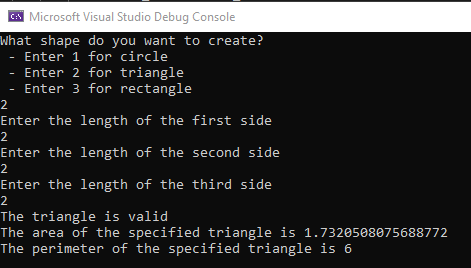
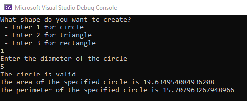
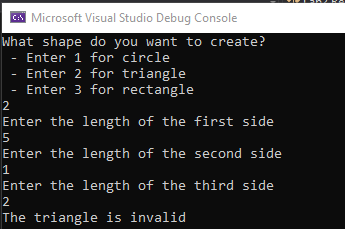
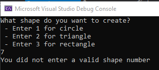

# CISS222 Spring 2021 - Lab 2

## Purpose
The purpose of this lab is to better understand the role that objects and classes play in software development using C#.

## Objective
This lab involves the creation of three C# classes: a Circle class, a Triangle class, and a Rectangle class. All of the classes will have similar characteristics and will implement the same basic functionality in ways specific to the given shape. Each class will have:

* A constructor that takes in a double parameter for each of the sides of the shape (or the diameter of the circle)
* A public boolean `IsValid` property with a getter that returns a calculation of whether or a valid shape can be formed based on the constructor parameters
* A public double `CalculateArea()` method that calculates the area of the shape based on the mathematical rules that apply to that shape
* A public double `CalculatePerimeter()` method that calculates the permiter of the shape based on the mathematical rules that apply to that shape

For a circle:

* Validity
   * All circles are valid by default because they are not constructed with sides
* Area
   * https://www.mathsisfun.com/geometry/circle-area.html
   * `A = π * r ^ 2`
* Perimeter
   * https://www.mathplanet.com/education/pre-algebra/more-about-equation-and-inequalities/calculating-the-circumference-of-a-circle
   * (for a circle, perimeter is referred to as circumference)
   * `C = 2 * π * r`

For a triangle:

* Validity
  * Recall that for 3 integers to form a triangle, the sum of the lengths of any two sides must be greater than the length of the third side. For example 3, 4, and 8 DO NOT form a triangle since 3 + 4 = 7 which is less than 8. It is easy to understand if you can visualize a triangle made of sticks with the 8 side on the ground and the 3 and 4 sides connected to the 8 side with hinges.  The 3 and 4 sides would never touch at the top - they would fall down until they were laying flat on the 8 side.
  * Note that to successfully perform this check, you need to check ALL THREE combinations of the sum of two sides against a third. Again, using the 3, 4, and 8 example, if the numbers were presented as 4, 8, and 3, one could (incorrectly) conclude that since 4 + 8 = 12 which is greater than 3, that these numbers do form a triangle, but as we know they actually do not.
 * Area
    * https://www.mathsisfun.com/geometry/herons-formula.html
    * Step 1: Calculate "s" (half of the triangles perimeter):
    * `s = a + b + c / 2`
    * Step 2: Then calculate the Area:
    * `A = √ s (s - a) (s - b) (s - c)`
 * Perimeter
    * https://www.wikihow.com/Find-the-Perimeter-of-a-Triangle
    * `P = A + B + C`

For a rectangle:
  * Validity
    * https://www.geeksforgeeks.org/check-given-four-integers-sides-make-rectangle/ 
  * Area
    * https://www.mathsisfun.com/geometry/rectangle.html
    * `A = L * W`
  * Perimeter
    * https://www.mathplanet.com/education/pre-algebra/inequalities-and-one-step-equations/calculating-the-area-and-the-perimeter
    * `C = 2 * (L + W)`

The menu system should prompt the user to enter in a number, and based on the number, the appropriate shape class is instantiated, validated, and (if valid) the area and perimeter displayed. An error should display if an invalid menu option is entered.

The menu should follow the pattern in the following screenshots:

A few additional notes:

* The prompts, input, and output should look exactly as it does in the screenshots, including the exact wording. 
* The calculation functionality must be implemented in the required methods and properties. No logic for computation should be done in the `Main()` method.
* Be sure to create three different class files in Visual Studio
* Formatting, such as line spacing, tabs, etc. should be appropriate and make the code easy to read.
* Comments are not required, but can be useful, especially if you want to explain an area of your code of which you may not have full confidence.

## Expectations and Grading
1. (10 pts) Create a C# class and implement the requested functionality for a circle.
1. (10 pts) Create a C# class and implement the requested functionality for a triangle.
1. (10 pts) Create a C# class and implement the requested functionality for a rectangle.
1. (5 pts) Implement a menu system to ask the user what shape to process, collect input, and to display the calculated information.

## Assignment Retrieval, Testing, and Submission
1. Pull down this repository from GitHub to your local machine.
1. You can check in your work, as well as push to GitHub, as infrequently or as often as you wish. However, you must ensure that your work is checked in and pushed, as that will be how your assignment is turned in. The code as of the due date and time will be the version that will be graded.
